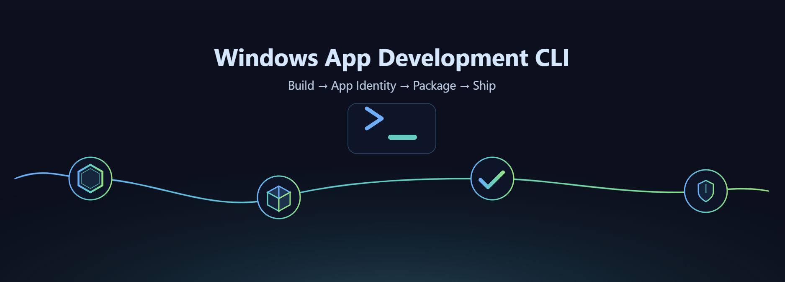

# Windows App Development Cli

> [!IMPORTANT]
> :warning: **Status: Public Preview** - The Windows App Development CLI is experimental and in active development. We'd love your feedback! Share your thoughts by creating an [issue](https://github.com/microsoft/WinAppCli/issues).

<p align="center">
    <picture>
      <source media="(prefers-color-scheme: dark)" srcset="./docs/images/hero-dark.png">
      <source media="(prefers-color-scheme: light)" srcset="./docs/images/hero-light.png">
      
    </picture>
</p>

<h3 align="center">
  <a href="#-installation">Installation</a>
  <span> . </span>
  <a href="#-usage">Usage</a>
  <span> . </span>
  <a href="./docs/usage.md">Documentation</a>
  <span> . </span>
  <a href="#-try-the-windows-identity-app">GUI</a>
  <span> . </span>
  <a href="#-feedback">Feedback</a>
</h3>
<br/>

The Windows App Development CLI is a single command-line interface for managing Windows SDKs, packaging, generating app identity, manifests, certificates, and using build tools with any app framework. This tool bridges the gap between cross-platform development and Windows-native capabilities.
<br/><br/>
Whether you're building with Electron, .NET/Win32, CMake, or Python, this CLI gives you access to:

- **Modern Windows APIs** - Windows App SDK and Windows SDK with automatic setup and code generation
- **App Identity** - Debug and test by adding app identity without full packaging in a snap
- **MSIX Packaging** - App packaging with signing and Store readiness
- **Developer Tools** - Manifests, certificates, assets, and build integration

Perfect for:

- **Electron/cross-platform developers** wanting native Windows features or targeting Windows
- **Developers testing and deploying** adding app identity for development or packaging for deployment
- **CI/CD pipelines** automating Windows app builds

## 📦 Installation

The easiest way to use the CLI is to download the latest build from GitHub Releases.

**[👉 Download Latest Build](https://github.com/microsoft/WinAppCli/releases/latest)**

**Available Options:**

| Package | Description | Use Case |
|---------|-------------|----------|
| **`winappcli_[version]_[platform].msix`** | 📦 MSIX Installer | Easy to install, automatically added to path, great for general usage |
| **`winappcli-[version]-[platform].zip`** | 📦 Standalone Binaries | Portable, no install needed - great for CI/CD |
| **`microsoft-winappcli-[version].tgz`** | 📚 NPM Package | For Node.js/Electron projects |

### Adding to Path

The easiest way to use the CLI globally is to install it via the [MSIX installer](https://github.com/microsoft/WinAppCli/releases/latest).

You can also add it manually: Windows Search → Edit the system environment variables → Environment Variables → Path → Edit → New → Add the location (folder) of winapp CLI.

## 📋 Usage

Once installed (see [Installation](#-installation) above), verify the installation by calling the CLI:

```bash
winapp --help
```

or if using Electron/Node.js

```bash
npx winapp --help
```

### Commands Overview

**Setup Commands:**

- [`init`](./docs/usage.md#init) - Initialize project with Windows SDK and App SDK
- [`restore`](./docs/usage.md#restore) - Restore packages and dependencies
- [`update`](./docs/usage.md#update) - Update packages and dependencies to latest versions

**App Identity & Debugging:**

- [`package`](./docs/usage.md#package) - Create MSIX packages from directories
- [`create-debug-identity`](./docs/usage.md#create-debug-identity) - Add temporary app identity for debugging
- [`manifest`](./docs/usage.md#manifest) - Generate and manage AppxManifest.xml files

**Certificates & Signing:**

- [`cert`](./docs/usage.md#cert) - Generate and install development certificates
- [`sign`](./docs/usage.md#sign) - Sign MSIX packages and executables

**Development Tools:**

- [`tool`](./docs/usage.md#tool) - Access Windows SDK tools
- [`get-winapp-path`](./docs/usage.md#get-winapp-path) - Get paths to installed SDK components

**Node.js/Electron Specific:**

- [`node create-addon`](./docs/usage.md#node-create-addon) - Generate native C# or C++ addons
- [`node add-electron-debug-identity`](./docs/usage.md#node-add-electron-debug-identity) - Add identity to Electron processes
- [Windows AI Addon for Electron](https://github.com/microsoft/winapp-windows-ai) - The Windows AI Addon for Electron is a Node.js native addon that provides access to the [Windows AI APIs](https://learn.microsoft.com/en-us/windows/ai/apis/) directly from JavaScript.

The full CLI usage can be found here: [Documentation](/docs/usage.md)

## 🔧 Feedback

- [File an issue, feature request or bug](https://github.com/microsoft/WinAppCli/issues): please ensure that you are not filing a duplicate issue
- Send feedback to <windowsdevelopertoolkit@microsoft.com>: Do you love this tool? Are there features or fixes you want to see? Let us know!

We are actively working on improving Node and Python support. These features are experimental and we are aware of several issues with these app types.

## 🧪 Try the Windows Identity App

This repository also contains an **experimental** app (GUI) that wraps the CLI and provides an intuitive, drag-and-drop experience. [See the docs](/docs/gui-usage.md) for more details. [Download the app here](https://github.com/microsoft/WinAppCli/releases/tag/v0.1.1-gui).

## 🧾 Samples

This repository will continue to be added with samples. Currently the following samples exist:

- [Electron sample](/samples/electron/README.md): a default Electron Forge generated application + initialized a winapp project with appxmanifest, assets + native addon + C# addon + generates cert

## Support

Need help or have questions about the Windows App Development CLI? Visit our **[Support Guide](./SUPPORT.md)** for information about our issue templates and triage process.

## Contributing

This project welcomes contributions and suggestions.  Most contributions require you to agree to a Contributor License Agreement (CLA) declaring that you have the right to, and actually do, grant us the rights to use your contribution. For details, visit [Contributor License Agreements](https://cla.opensource.microsoft.com).

When you submit a pull request, a CLA bot will automatically determine whether you need to provide a CLA and decorate the PR appropriately (e.g., status check, comment). Simply follow the instructions provided by the bot. You will only need to do this once across all repos using our CLA.

This project has adopted the [Microsoft Open Source Code of Conduct](https://opensource.microsoft.com/codeofconduct/).
For more information see the [Code of Conduct FAQ](https://opensource.microsoft.com/codeofconduct/faq/) or contact [opencode@microsoft.com](mailto:opencode@microsoft.com) with any additional questions or comments.

To build the CLI:
```
# Build the CLI and package for npm from the repo root
.\scripts\build-cli.ps1
```

The binaries and packages will be placed in the `artifacts` folder

## Trademarks

This project may contain trademarks or logos for projects, products, or services. Authorized use of Microsoft
trademarks or logos is subject to and must follow
[Microsoft's Trademark & Brand Guidelines](https://www.microsoft.com/legal/intellectualproperty/trademarks/usage/general).
Use of Microsoft trademarks or logos in modified versions of this project must not cause confusion or imply Microsoft sponsorship.
Any use of third-party trademarks or logos are subject to those third-party's policies.
