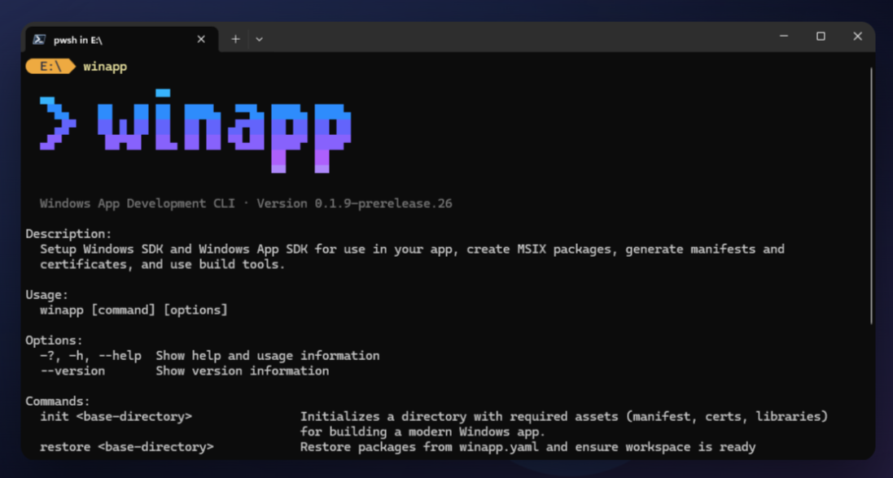

# winapp CLI

> [!IMPORTANT]
> :warning: **Status: Public Preview** - The Windows App Development CLI (winapp CLI) is experimental and in active development. We'd love your feedback! Share your thoughts by creating an [issue](https://github.com/microsoft/WinAppCli/issues).

<p align="center">
    <picture>
      
    </picture>
</p>
<br/>
<p align="center">
  
  <a href="https://www.npmjs.com/package/@microsoft/winappcli">
    
  </a>
  <a href="https://github.com/microsoft/WinAppCli/releases/latest">
    
  </a>
  <br />
  <a href="https://github.com/microsoft/WinAppCli/issues">
    
  </a>
  <a href="https://github.com/microsoft/WinAppCli/blob/main/LICENSE">
    
  </a>
  <br />
</p>

<h3 align="center">
  <a href="#%EF%B8%8F-get-started">Get Started Guides</a>
  <span> • </span>
  <a href="#-installation">Installation</a>
  <span> • </span>
  <a href="#-usage">Usage</a>
  <span> • </span>
  <a href="./docs/usage.md">Documentation</a>
  <span> • </span>
  <a href="#-try-the-windows-identity-app">GUI</a>
  <span> • </span>
  <a href="#-feedback">Feedback</a>
</h3>
<br/>

The Windows App Development CLI (winapp CLI) is a single command-line interface for managing Windows SDKs, packaging, generating app identity, manifests, certificates, and using build tools with any app framework. This tool bridges the gap between cross-platform development and Windows-native capabilities.
<br/><br/>
Whether you're building with Electron, .NET/Win32, CMake, or Python, this CLI gives you access to:

- **Modern Windows APIs** - [Windows App SDK](https://learn.microsoft.com/windows/apps/windows-app-sdk/) and Windows SDK with automatic setup and code generation
- **App Identity** - Debug and test by adding app identity without full packaging in a snap
- **MSIX Packaging** - App packaging with signing and Store readiness
- **Developer Tools** - Manifests, certificates, assets, and build integration

Perfect for:

- **Electron/cross-platform developers** wanting native Windows features or targeting Windows
- **Developers testing and deploying** adding app identity for development or packaging for deployment
- **CI/CD pipelines** automating Windows app builds

## ✏️ Get started

Checkout our getting started guides for step by step instructions of how to setup your environment, generate manifests, assets, and certificate, how to debug APIs that require package identity, and how to MSIX package your app.

<p>
  <a href="/docs/electron-get-started.md">
    
  </a>
    <br />
  <a href="./docs/guides/dotnet.md">
    
  </a>
    <br />
  <a href="./docs/guides/cpp.md">
    
  </a>
    <br />
  <a href="./docs/guides/rust.md">
    
  </a>
    <br />
  <a href="/docs/guides/tauri.md">
    
  </a>
</p>

Additional guides:
- [Packaging an EXE/CLI](/docs/guides/packaging-cli.md): step by step guide of packaging an existing exe/cli as MSIX

## 📦 Installation

### WinGet 

The easiest way to use the CLI is via WinGet (Windows Package Manager). In Terminal, simply run:

`winget install Microsoft.winappcli --source winget`

### NPM <a href="https://www.npmjs.com/package/@microsoft/winappcli"> </a>


You can install the CLI for Electron projects via NPM:

`npm install @microsoft/winappcli --save-dev`

### GitHub Actions / Azure DevOps

For CI/CD pipelines on GitHub Actions or Azure DevOps, use the [`setup-WinAppCli`](https://github.com/microsoft/setup-WinAppCli?tab=readme-ov-file#setup-windows-app-developer-cli) action to automatically install the CLI on your runners/agents.

### Download Release Manually

**[Download the latest build from GitHub Releases](https://github.com/microsoft/WinAppCli/releases/latest)**

## 📋 Usage

Once installed (see [Installation](#-installation) above), verify the installation by calling the CLI:

```bash
winapp --help
```

or if using Electron/Node.js

```bash
npx winapp --help
```

### Commands Overview

**Setup Commands:**

- [`init`](./docs/usage.md#init) - Initialize project with Windows SDK and App SDK
- [`restore`](./docs/usage.md#restore) - Restore packages and dependencies
- [`update`](./docs/usage.md#update) - Update packages and dependencies to latest versions

**App Identity & Debugging:**

- [`package`](./docs/usage.md#package) - Create MSIX packages from directories
- [`create-debug-identity`](./docs/usage.md#create-debug-identity) - Add temporary app identity for debugging
- [`manifest`](./docs/usage.md#manifest) - Generate and manage AppxManifest.xml files

**Certificates & Signing:**

- [`cert`](./docs/usage.md#cert) - Generate and install development certificates
- [`sign`](./docs/usage.md#sign) - Sign MSIX packages and executables

**Development Tools:**

- [`tool`](./docs/usage.md#tool) - Access Windows SDK tools
- [`store`](./docs/usage.md#store) - Run Microsoft Store Developer CLI commands
- [`get-winapp-path`](./docs/usage.md#get-winapp-path) - Get paths to installed SDK components

**Node.js/Electron Specific:**

- [`node create-addon`](./docs/usage.md#node-create-addon) - Generate native C# or C++ addons
- [`node add-electron-debug-identity`](./docs/usage.md#node-add-electron-debug-identity) - Add identity to Electron processes
- [`node clear-electron-debug-identity`](./docs/usage.md#node-clear-electron-debug-identity) - Remove identity from Electron processes
- [Windows AI Addon for Electron](https://github.com/microsoft/winapp-windows-ai) - The Windows AI Addon for Electron is a Node.js native addon that provides access to the [Windows AI APIs](https://learn.microsoft.com/en-us/windows/ai/apis/) directly from JavaScript.

The full CLI usage can be found here: [Documentation](/docs/usage.md)


## 🧾 Samples

This repository includes samples demonstrating how to use the CLI with various frameworks:

| Sample | Description |
|--------|-------------|
| [Electron](/samples/electron/README.md) | Electron Forge app with appxmanifest, assets, native C++ addon, and C# addon |
| [Electron WinML](/samples/electron-winml/README.md) | Electron app using Windows ML for image classification |
| [C++ App](/samples/cpp-app/README.md) | Native C++ Win32 application with CMake |
| [.NET Console](/samples/dotnet-app/README.md) | .NET console application |
| [WPF App](/samples/wpf-app/README.md) | WPF desktop application |
| [Rust App](/samples/rust-app/README.md) | Rust application using Windows APIs |
| [Tauri App](/samples/tauri-app/README.md) | Tauri cross-platform app with Rust backend |

## 🔧 Feedback

- [File an issue, feature request or bug](https://github.com/microsoft/WinAppCli/issues): please ensure that you are not filing a duplicate issue
- Send feedback to <windowsdevelopertoolkit@microsoft.com>: Do you love this tool? Are there features or fixes you want to see? Let us know!

We are actively working on improving Node and Python support. These features are experimental and we are aware of several issues with these app types.

## 🧪 Try the Windows Identity App

This repository also contains an **experimental** app (GUI) that wraps the CLI and provides an intuitive, drag-and-drop experience. [See the docs](/docs/gui-usage.md) for more details. [Download the app here](https://github.com/microsoft/WinAppCli/releases/tag/v0.1.1-gui).

## Support

Need help or have questions about the Windows App Development CLI? Visit our **[Support Guide](./SUPPORT.md)** for information about our issue templates and triage process.

## Contributing

This project welcomes contributions and suggestions.  Most contributions require you to agree to a Contributor License Agreement (CLA) declaring that you have the right to, and actually do, grant us the rights to use your contribution. For details, visit [Contributor License Agreements](https://cla.opensource.microsoft.com).

When you submit a pull request, a CLA bot will automatically determine whether you need to provide a CLA and decorate the PR appropriately (e.g., status check, comment). Simply follow the instructions provided by the bot. You will only need to do this once across all repos using our CLA.

This project has adopted the [Microsoft Open Source Code of Conduct](https://opensource.microsoft.com/codeofconduct/).
For more information see the [Code of Conduct FAQ](https://opensource.microsoft.com/codeofconduct/faq/) or contact [opencode@microsoft.com](mailto:opencode@microsoft.com) with any additional questions or comments.

To build the CLI:
```
# Build the CLI and package for npm from the repo root
.\scripts\build-cli.ps1
```

The binaries and packages will be placed in the `artifacts` folder

## Trademarks

This project may contain trademarks or logos for projects, products, or services. Authorized use of Microsoft
trademarks or logos is subject to and must follow
[Microsoft's Trademark & Brand Guidelines](https://www.microsoft.com/legal/intellectualproperty/trademarks/usage/general).
Use of Microsoft trademarks or logos in modified versions of this project must not cause confusion or imply Microsoft sponsorship.
Any use of third-party trademarks or logos are subject to those third-party's policies.
