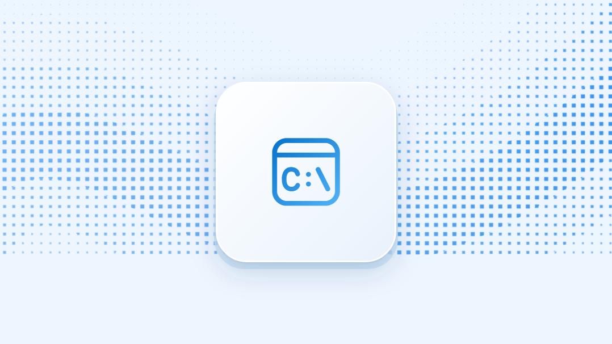

<!-- mslearn: true -->
<!-- ms.topic: overview -->
<!-- description: Use winapp CLI to create, run, debug, test, and package WinUI apps, and to add Windows APIs, identity, and MSIX to apps on any framework. -->
# Windows App Development CLI (winapp CLI)

> [!IMPORTANT]
> The Windows App Development CLI is currently in **public preview**. Features and commands may change before the final release. Share your feedback by [creating an issue](https://github.com/microsoft/WinAppCli/issues).

The Windows App Development CLI (winapp CLI) is a command-line tool for building Windows apps. Use it to create, run, debug, test, and package [WinUI](https://learn.microsoft.com/windows/apps/winui/winui3/) apps from a terminal, the editor you prefer, or an AI coding agent.

The same commands also bring the [Windows App SDK](https://learn.microsoft.com/windows/apps/windows-app-sdk/), package identity, and MSIX packaging to apps built with other frameworks, such as .NET, C++, Electron, Flutter, Rust, and Tauri.

## Key benefits of winapp CLI

:::row:::
    :::column:::
        
    :::column-end:::
    :::column span="2":::
        **Create and run WinUI apps from the terminal**<br>
         `winapp new` creates a WinUI app from the official templates, including blank, NavigationView, TabView, and MVVM starters. `winapp run` builds the project, installs the matching Windows App Runtime, and launches the app, whether it's packaged or unpackaged.
         <br>
         [Build your first WinUI app](https://learn.microsoft.com/windows/apps/get-started/start-here)
    :::column-end:::
:::row-end:::

:::row:::
    :::column:::
        
    :::column-end:::
    :::column span="2":::
        **Debug with package identity and crash diagnostics**<br>
         Run your app with package identity so you can test notifications, on-device AI, and other APIs that require identity. Add `--debug-output` to capture debug messages and crash dumps. For WinUI crashes, winapp decodes stowed exceptions to point you at the XAML event handler that failed.
         <br>
         [Debugging with package identity](debugging.md)
    :::column-end:::
:::row-end:::

:::row:::
    :::column:::
        
    :::column-end:::
    :::column span="2":::
        **Ground AI coding agents in real WinUI code**<br>
         `winapp find-ui` returns working XAML and C# from the WinUI 3 Gallery and the Windows Community Toolkit. `winapp find-api` inspects the Windows Runtime APIs your project references. Agents use them to generate code from real samples and metadata instead of guessing.
         <br>
         [Use winapp CLI with AI agents](#use-winapp-cli-with-ai-agents)
    :::column-end:::
:::row-end:::

:::row:::
    :::column:::
        
    :::column-end:::
    :::column span="2":::
        **Automate and test your app's UI**<br>
         `winapp ui` inspects and interacts with running apps through UI Automation, and captures screenshots and recordings. Run your app in Windows Sandbox to test it in a clean environment.
         <br>
         [UI automation](ui-automation.md)
    :::column-end:::
:::row-end:::

:::row:::
    :::column:::
        
    :::column-end:::
    :::column span="2":::
        **Package, sign, and ship**<br>
         `winapp pack` builds your project, packages it as MSIX, and signs it in one step. Generate development certificates locally, sign release builds with Azure Trusted Signing, and install winapp CLI on GitHub Actions or Azure DevOps runners.
         <br>
         [Package your app](usage.md#pack)
    :::column-end:::
:::row-end:::

:::row:::
    :::column:::
        
    :::column-end:::
    :::column span="2":::
        **Bring Windows features to any framework**<br>
         Add the Windows SDK and Windows App SDK, package identity, and MSIX packaging to apps built with .NET, C++, Electron, Flutter, Rust, or Tauri, without changing your build system.
         <br>
         [See supported frameworks](#supported-frameworks)
    :::column-end:::
:::row-end:::

## Get started with WinUI

After you [install winapp CLI](#installation) and the [.NET SDK](https://dotnet.microsoft.com/download), create and run a WinUI app:

```powershell
winapp new --name MyWinUIApp --template winui-navview --use-defaults
cd MyWinUIApp
winapp run
```

When you're ready to share the app, generate a development certificate and create a signed MSIX package:

```powershell
winapp cert generate --manifest ./Package.appxmanifest
winapp pack ./MyWinUIApp.csproj -c Release --cert ./devcert.pfx
```

For a step-by-step walkthrough that includes setup and your first UI change, see [Build your first WinUI app](https://learn.microsoft.com/windows/apps/get-started/start-here). To see all available templates, run `winapp new --list`. For the complete workflow, including debugging, UI automation, and packaging, see [Using winapp CLI with WinUI](guides/winui.md).

## Installation

### WinGet

The easiest way to install the CLI is via WinGet (Windows Package Manager):

```powershell
winget install Microsoft.winappcli --source winget
```

If you use the WinGet PowerShell module, run `Install-WinGetPackage Microsoft.winappcli` instead.

### NPM

For Electron projects, install via NPM:

```powershell
npm install @microsoft/winappcli --save-dev
```

### GitHub Actions / Azure DevOps

For CI/CD pipelines, use the [`setup-WinAppCli`](https://github.com/microsoft/setup-WinAppCli) action to automatically install the CLI on your runners/agents.

### Manual download

Download the latest build from [GitHub Releases](https://github.com/microsoft/WinAppCli/releases/latest).

## Verify installation

Once installed, verify the installation by calling the CLI:

```bash
winapp --help
```

Or if using Electron/Node.js:

```bash
npx winapp --help
```

## Use winapp CLI with AI agents

winapp CLI is designed to work well with AI coding agents. Commands such as `find-ui` and `find-api` return machine-readable output with `--json`, so an agent can look up real WinUI samples and Windows Runtime APIs before it writes code.

Install the winapp plugin to give your agent skills for the winapp CLI workflow:

```powershell
# GitHub Copilot CLI
copilot plugin install microsoft/WinAppCli

# Claude Code
claude plugin marketplace add microsoft/WinAppCli
claude plugin install winappcli@winappcli
```

If you work in Visual Studio Code, the [WinApp VS Code extension](https://learn.microsoft.com/windows/apps/develop/ai-assisted/vs-code-tools#winapp-vs-code-extension) runs winapp CLI commands from the editor and launches your app with package identity when you press **F5**. Install it from the [Visual Studio Marketplace](https://marketplace.visualstudio.com/items?itemName=Microsoft-WinAppCLI.winapp).

## Supported frameworks

winapp CLI works with WinUI and other app frameworks:

| Framework | Guide |
|-----------|-------|
| WinUI | [Get started with WinUI](guides/winui.md) |
| .NET / WPF / WinForms | [Get started with .NET](guides/dotnet.md) |
| .NET MAUI | [Get started with .NET MAUI](guides/maui.md) |
| C++ (CMake) | [Get started with C++](guides/cpp.md) |
| Electron | [Get started with Electron](guides/electron/index.md) |
| Rust | [Get started with Rust](guides/rust.md) |
| Tauri | [Get started with Tauri](guides/tauri.md) |
| Flutter | [Get started with Flutter](guides/flutter.md) |

Additional guides:
- [Packaging an EXE/CLI](guides/packaging-cli.md): step-by-step guide for packaging an existing EXE/CLI as MSIX
- [Sparse packaging](guides/sparse.md): give an unpackaged app package identity with an identity-only (sparse) MSIX and external content
- [Shell Completion](guides/shell-completion.md): enable tab completion for commands, options, and values in PowerShell, bash, zsh, and fish
- [Security guidance](security.md): what development certificates and Developer Mode change on your machine, how to handle `devcert.pfx`, and how to sign for production

## Commands overview

| Category | Commands |
|----------|----------|
| **Create & set up** | [new](usage.md#new), [init](usage.md#init), [restore](usage.md#restore), [update](usage.md#update) |
| **Run & debug** | [run](usage.md#run), [create-debug-identity](usage.md#create-debug-identity), [embed-identity](usage.md#embed-identity), [unregister](usage.md#unregister) |
| **Packaging** | [pack](usage.md#pack) |
| **Manifests** | [manifest generate](usage.md#manifest-generate), [manifest update-assets](usage.md#manifest-update-assets), [manifest add-alias](usage.md#manifest-add-alias) |
| **Certificates & Signing** | [cert generate](usage.md#cert-generate), [cert install](usage.md#cert-install), [sign](usage.md#sign), [az-sign](usage.md#az-sign), [create-external-catalog](usage.md#create-external-catalog) |
| **Code search for agents** | [find-ui](usage.md#find-ui), [find-api](usage.md#find-api) |
| **UI automation & Sandbox** | [ui](usage.md#ui), [target](usage.md#target) |
| **Utilities** | [tool](usage.md#tool), [store](usage.md#store), [get-winapp-path](usage.md#get-winapp-path), [complete](usage.md#shell-completion) |
| **Node.js/Electron** | [node create-addon](usage.md#node-create-addon), [node generate-bindings](usage.md#node-generate-bindings), [node add-electron-debug-identity](usage.md#node-add-electron-debug-identity), [node clear-electron-debug-identity](usage.md#node-clear-electron-debug-identity) |

For the full CLI reference, see [CLI reference](usage.md).

## Samples

The [samples folder](https://github.com/microsoft/WinAppCli/tree/main/samples) on GitHub has a runnable project for each supported framework:

| Sample | Description |
|--------|-------------|
| [WinUI app](https://github.com/microsoft/WinAppCli/tree/main/samples/winui-app) | Packaged WinUI app registered and launched with `winapp run` |
| [WinUI unpackaged app](https://github.com/microsoft/WinAppCli/tree/main/samples/winui-unpackaged-app) | Unpackaged WinUI app launched with `winapp run` |
| [WinUI solution](https://github.com/microsoft/WinAppCli/tree/main/samples/winui-solution) | Multi-project solution (app and test project) that shows how `winapp run` selects the app project |
| [C++ WinUI app](https://github.com/microsoft/WinAppCli/tree/main/samples/cpp-app-winui) | WinUI window built in C++ with CMake, without XAML or MSBuild |
| [WPF app](https://github.com/microsoft/WinAppCli/tree/main/samples/wpf-app) | WPF desktop app |
| [.NET MAUI app](https://github.com/microsoft/WinAppCli/tree/main/samples/maui-app) | .NET MAUI Windows project packaged and signed with winapp CLI |
| [C++ app](https://github.com/microsoft/WinAppCli/tree/main/samples/cpp-app) | Native C++ Win32 app built with CMake |
| [Electron](https://github.com/microsoft/WinAppCli/tree/main/samples/electron) | Electron Forge app with a manifest, assets, and native C++ and C# addons |
| [Rust app](https://github.com/microsoft/WinAppCli/tree/main/samples/rust-app) | Rust app that calls Windows APIs |
| [Tauri app](https://github.com/microsoft/WinAppCli/tree/main/samples/tauri-app) | Tauri app with a Rust backend |
| [Flutter app](https://github.com/microsoft/WinAppCli/tree/main/samples/flutter-app) | Flutter desktop app with package identity and the Windows App SDK |
| [Sparse app](https://github.com/microsoft/WinAppCli/tree/main/samples/sparse-app) | WPF app with sparse packaging (identity-only MSIX) and an installer |

## Why package identity?

Many Windows APIs require your app to have package identity. With identity, your app gains access to features like notifications, OS integration, and on-device AI. WinUI app templates include a package manifest, so `winapp run` gives them identity by default. For a full list of what package identity unlocks and help choosing the right packaging model, see [Packaging overview](https://learn.microsoft.com/windows/apps/package-and-deploy/packaging/).

## Open source

winapp CLI is open source. You can find the source code, file issues, and contribute on [GitHub](https://github.com/microsoft/WinAppCli). For help, see [Support](https://github.com/microsoft/WinAppCli/blob/main/SUPPORT.md).

## Related topics

- [Build your first WinUI app](https://learn.microsoft.com/windows/apps/get-started/start-here)
- [WinUI overview](https://learn.microsoft.com/windows/apps/winui/winui3/)
- [CLI reference](usage.md)
- [Debugging with package identity](debugging.md)
- [Security guidance](security.md)
- [UI automation](ui-automation.md)
- [Windows Sandbox execution](sandbox-execution.md)
- [NPM programmatic API](npm-usage.md)
- [Framework guides](guides/dotnet.md)
- [Windows App SDK documentation](/windows/apps/windows-app-sdk/)
- [MSIX packaging documentation](/windows/msix/)
