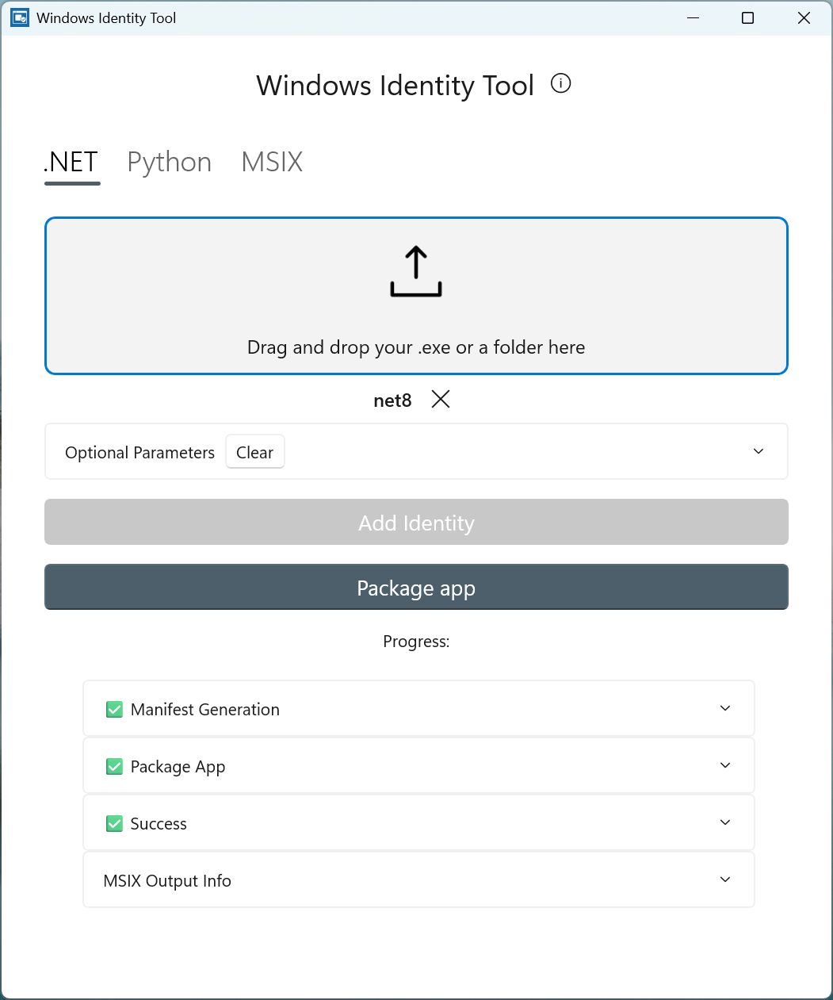
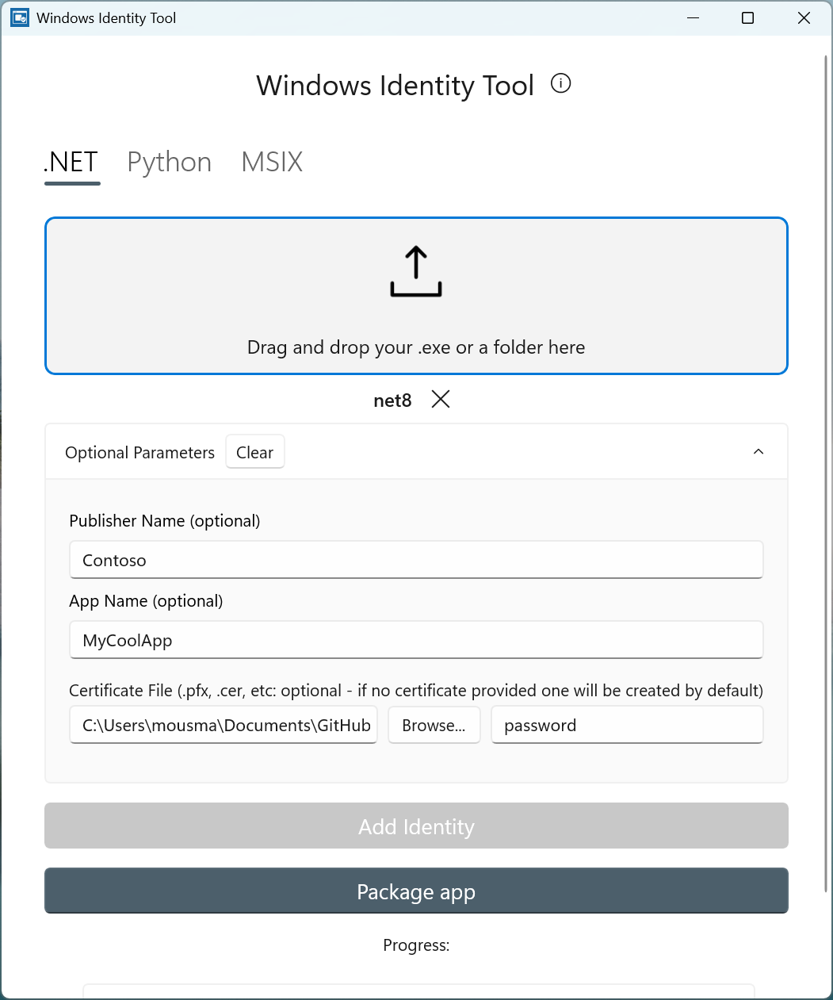

## 🧪 Windows Identity Tool Usage

This is an **experimental** app (GUI) that wraps the CLI and provides an intuitive, drag-and-drop experience with the following features:

- Supports .NET (Winforms, WPF..etc) apps, Python scripts/folders, MSIX
- Drop in a WinForms, WPF executable (.exe) to add development/debug app identity (via external location/sparse packaging) in a single click!
- Drop in a WinForms, WPF folder to package your app (MSIX) in a single click
- Drop in an MSIX to sign and register it locally in a single click
- Drop in a Python (.py) file to add debug identity in a single click

The Windows Development CLI **must** be in your [PATH](#adding-to-path) for the Identity Tool to function since it calls the CLI.

  <table>
    <tr>
      <td width="50%">
        
      </td>
      <td width="50%">
        
      </td>
    </tr>
  </table>

### Install the GUI Tool

1. **[👉 Download Latest Experimental Build (unsigned .msix)](https://github.com/microsoft/winsdk/releases/latest)**
2. Run Powershell as Administrator and `Add-AppPackage -Path <msix> -AllowUnsigned`

`<msix>` should be replaced with the full path of the downloaded build (msix file).

Alternatively, you can clone and build this repository. Run Identity.GUI.Experimental in Visual Studio to build and run the app.

Please note that this app is experimental and may have issues as we gather feedback on the functionality, usefulness and value of the UI-based solution. If you see value or issues in this app, please let us know through [Feedback](#feedback)! The app will add functionality for Electron and mirror the CLI going forward depending on user feedback.
