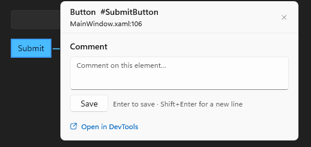

# Inspect a WinUI app with DevTools

DevTools lets you inspect a running WinUI 3 app, try live property changes, diagnose
bindings, and leave comments on elements for an agent to turn into code changes. For
Sandbox, attaching to a running app, query targeting, comment storage, the protocol
and troubleshooting, see [Advanced DevTools](devtools-advanced.md). Every command's
`--help` lists its options and examples.

## Get started

1. From your WinUI project directory, build and launch the app:

   ```powershell
   winapp run .
   ```

   The app opens with the DevTools toolbar in a corner. The command waits for the app;
   cancelling it stops the app it launched.

2. Select **Comments** on the toolbar, then click an element in your app. The comment
   panel opens next to it, showing where the element is declared.

   

3. Type a note and press **Enter**. **Shift+Enter** starts a new line. A **Comment
   saved** notice appears and the comments count goes up. To comment on another
   element, click it: what you typed is saved and the panel moves.

4. To inspect an element, select **Select element** and click it. The DevTools window
   opens beside your app with the element tree, properties, bindings and layout.

   

5. Ask your agent to read the comments and make the changes:

   ```powershell
   winapp devtools comments list
   ```

### Turn DevTools on or off

`winapp run` starts DevTools for a WinUI project: a `.csproj` with `UseWinUI`, or a
C++ `.vcxproj` that uses the Windows App SDK and has XAML pages. It prints one line
saying so and how to turn it off. It doesn't start DevTools in CI (when `CI` is set),
with `--no-launch`, `--without-alias` or `--on sandbox`, or for a build-output folder,
a .NET file-based app or a project that isn't WinUI.

For one run, pass `--devtools on`, `--devtools headless` or `--devtools off`.
`headless` draws nothing in your app until you press **Ctrl+Shift+F12**; `winapp
devtools` commands still work. With `dotnet run` and the
`Microsoft.Windows.SDK.BuildTools.WinApp` package, use an MSBuild property:

```powershell
dotnet run -p:WinAppRunDevTools=off      # or headless, or on
```

To change the default for your user account (the toolbar's **⋯** menu changes the
same setting):

```powershell
winapp config set run.devtools off    # or headless, or on
winapp config unset run.devtools      # back to the default, on
```

If DevTools can't start in a run where you didn't pass `--devtools`, the app runs
without it and winapp says why; with `--devtools on` or `headless`, that's an error.
If the app is already running, `run` closes it so DevTools can start it.

## Use the toolbar

- **Select element** selects the element you click in the DevTools window.
- **Comments** opens the comment panel on the element you click. It shows the
  element's XAML file and line, or **Not linked to source** when there is none, and
  any comments already on it. **Open in DevTools** opens the window on that element.

Turning one mode on turns the other off. Esc saves what you typed and closes the panel;
the next Esc turns the mode off. Clicking a control's template part or generated text,
such as a Button's string content, selects the control from your XAML. To pick
template parts themselves, turn off **Just my XAML** in the DevTools window.

Saved comments show as markers on their elements, including comments an agent added.
The arrow beside **Comments** has **Open comments list (N)** and **Show comment
markers**; hiding markers is remembered until you show them again.

**Ctrl+Shift+F12** moves keyboard focus to the toolbar (and shows it if it's hidden);
Esc returns focus to your app. The **⋯** menu has:

- **Hide toolbar**: hides it until you press **Ctrl+Shift+F12**.
- **Keep toolbar open**: keeps it expanded instead of collapsing to its pill.
- **When the app starts**: **Show toolbar** (`on`), **Hide toolbar** (`headless`) or
  **Don't start DevTools** (`off`), the same setting as `winapp config set run.devtools`.

In the DevTools window, **Comment** in the properties header comments on the selected
element. Property values follow your app as it changes them; **F5** rereads the tree.

## Review comments with an agent

```powershell
winapp devtools comments list
winapp devtools comments get cmt_example
winapp devtools comments update cmt_example --status resolved --note "Updated the label"
```

`list` shows open comments (`--all` adds resolved, stale and dismissed ones; `--json`
includes every status). It reads the project's comment store, so the app doesn't need
to be running. `get` shows the captured declaration and where it matches your source
now, and for a live element, its style and brushes with their resource keys, so a
request like "make this warmer" leads to the resource to change.

A match is confirmed when the declaration or `x:Name` matches exactly one place,
including after lines move. Otherwise `get` lists ranked candidates: confirm the
intended one before editing. A comment marked **Not linked to source** (`weak` and
`requiresConfirmation` in `--json`) has no source location; search the project for its
`x:Name`, AutomationId or text.

The agent should verify the location, make the change, and resolve the comment after
checking the result. If the element can't be confirmed, mark it stale instead of
guessing:

```powershell
winapp devtools comments update cmt_example --status stale --note "Element moved"
```

Every change to a comment refreshes the markers in your running DevTools apps.

## Find and inspect an element

```powershell
winapp devtools inspect
winapp devtools search Save
winapp devtools get-property SaveButton Content
winapp devtools get-source SaveButton
winapp devtools diagnose-binding SaveButton Content
winapp devtools set-property SaveButton Width 200
```

Target an element with the selector printed in brackets, a unique `x:Name`, or a
unique AutomationId (the same one `winapp ui` uses). Ambiguous names fail and list
the candidates. When more than one app has DevTools, add `-a <pid, name or title>`.

`inspect` and `search` show where each element is declared, such as
`MainWindow.xaml:37`, when DevTools can confirm it against your source. They show your
own XAML; add `--all` for framework and control-template elements. `search` matches
text, type, `x:Name`, AutomationId and file. To filter by property, use `--of-type`
and `--with`:

```powershell
winapp devtools search --of-type TextBlock --with 'FontSize>=20' --fields 'Text,FontSize'
```

`set-property` reports the value before and after. Changes are live only: they don't
edit your source and are gone when the app restarts. Setting a bound property replaces
its binding until you restart the app; the output warns you. `diagnose-binding` shows
what a binding resolves to; add `--json` for every observation.

Passwords never leave the app: password properties show as `<redacted>`, DevTools
refuses to set them, and passwords in your XAML show as `******` in source previews
and comments.

For a terminal you keep using, launch with `winapp run . --detach`: it prints the PID
and the next command. For scripts, add `--json`; see
[JSON output](devtools-advanced.md#json-output).