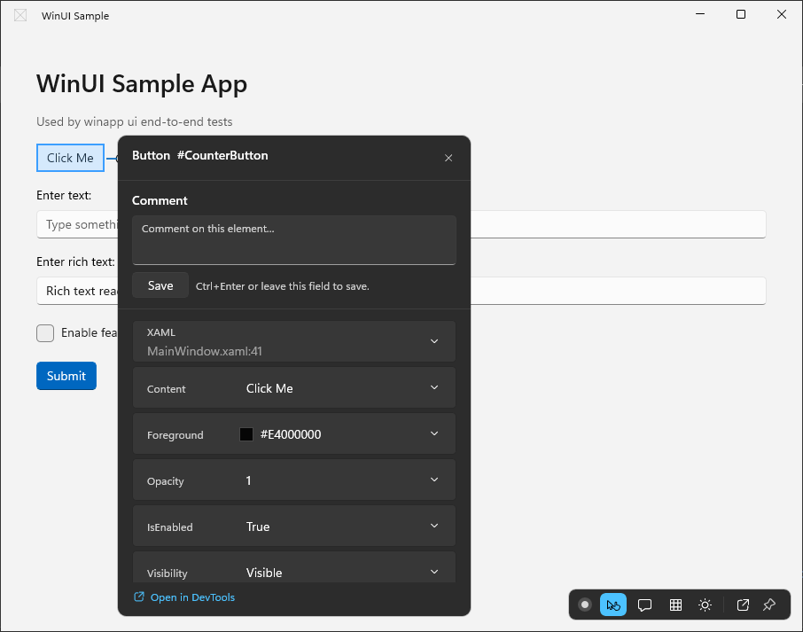
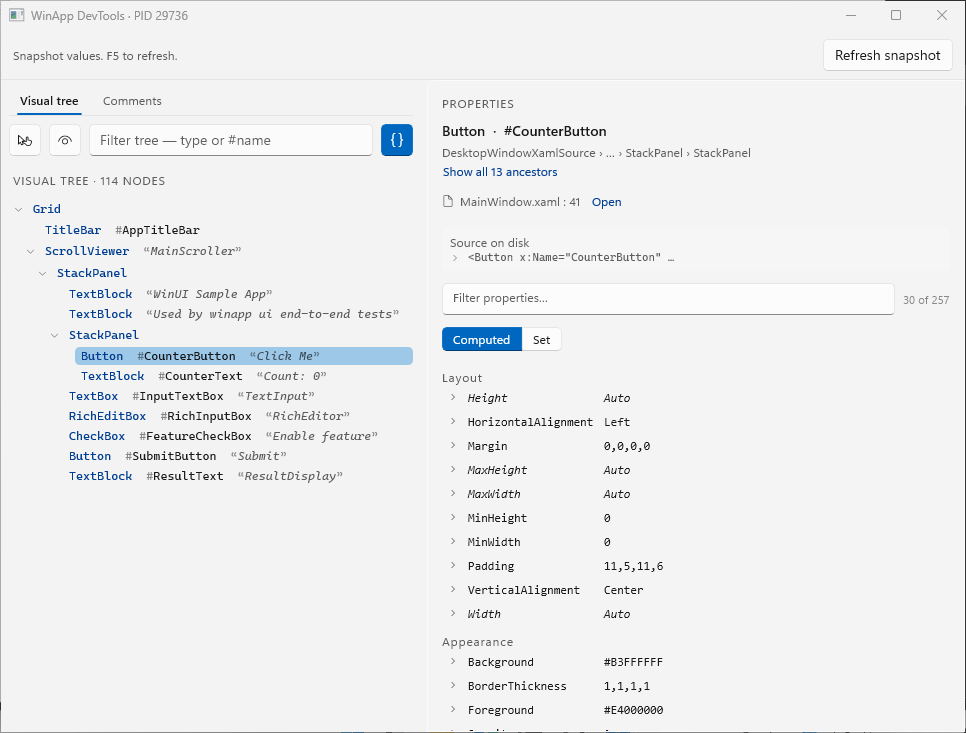

# Inspect a WinUI app with DevTools

DevTools lets you inspect a running WinUI 3 app built with the Windows App SDK,
try live property changes, diagnose bindings, and leave comments on elements for an
agent to turn into code changes. For Sandbox, attaching to a running app, window
and subtree targeting, comment storage and the raw protocol, see
[Advanced DevTools](devtools-advanced.md). From a terminal, `winapp devtools --help` shows the
workflow and commands; each command's `--help` shows examples.

## Get started

1. From your WinUI project directory, build and launch the app with DevTools:

   ```powershell
   winapp run . --devtools
   ```

   The app opens with the DevTools toolbar in a corner. The command waits for the
   app; cancelling it stops the process it launched.

2. Select **Select element** on the toolbar, then click an element in your app.
   The comment panel opens next to it, showing where the element is declared, ready
   for a comment.

   

3. Type a note and press **Enter** (or select **Save**). **Shift+Enter** starts a new
   line. A **Comment saved** notice appears by the toolbar, the panel closes and the
   comments count goes up. If the comment can't be linked to source, the notice and the
   panel say **Not linked**, and the panel stays open.

   To comment on several elements, just click the next one: the comment you typed is
   saved and the panel moves to the element you clicked. Esc also saves what you typed
   before it closes the panel.

4. For the full element tree, properties and bindings, select **Open in DevTools**.

   

5. Ask your agent to read the comments and make the changes:

   ```powershell
   winapp devtools comments list
   ```

   See [Review comments with an agent](#review-comments-with-an-agent).

### The overlay

The comment panel shows the element, its XAML file and line (or **Not linked to source**),
a **Comment** box, and any other comments already on the element. To change properties,
bindings or colors, select **Open in DevTools**: the inspector window has every editor.

Hover picking pauses while the comment panel is open, preserving
your selection and draft. Clicking the selected element keeps it selected; clicking
another element saves what the panel holds and moves it there. Esc saves
a comment you typed and closes the panel; the next Esc turns pick mode off. When your app has several windows, pick
mode works in the one in front; bring another window forward to pick in it.

Picking selects the element you declared: clicking a control's template part or its
generated text, such as a TextBox's placeholder or a Button's string content, selects
the control from your XAML. This includes parts of control templates your app restyles
in its own XAML. With a menu, drop-down or flyout open, picking selects the item you
see under the pointer. An element with no authored ancestor, such as a generated list
item, selects the control it belongs to (for example the `ComboBoxItem`);
a comment on it is saved but marked **Not linked to source**. To pick framework and
template parts themselves, turn off **Just my XAML** in the inspector window.

Comment markers follow elements on the active window's XamlRoot. Comments that
cannot resolve there remain saved but unplaced. Markers disappear while their
element or an ancestor is collapsed, unloaded, or fully transparent, and return
when the element is shown again. The Comments badge counts all saved open comments,
not just markers currently visible.

The toolbar, highlight and markers draw above your app, including over open dialogs
and flyouts, and stay out of your app's visual tree and layout. Menus and drop-downs
that open in their own window, such as a `MenuFlyout` or a `ComboBox` list, draw over
them; clicks there go to the menu, and the toolbar or marker underneath responds again
once the menu closes. In pick mode, a click on a menu picks the menu item. The comment panel opens clear
of the toolbar. Screen readers and `winapp ui` find the toolbar under a **DevTools** pane in the window.

Press **Ctrl+Shift+F12** in your app to move keyboard focus to the toolbar. Tab moves
between its actions, and Esc returns focus to where it was. If pick mode is on, the
next Esc turns it off. The shortcut does nothing while the toolbar is hidden,
for example after `winapp run --devtools --no-overlay`.

Use a project, solution, build-output folder, or .NET file-based app as the `run`
input. A DevTools launch prepares source diagnostics and, for managed apps, startup
binding support before the app starts. It preserves unrelated startup hooks and
developer environment settings.

For a project configured for Native AOT, use:

```powershell
winapp run . --aot --devtools
```

Native inspection and comments remain available. Managed binding diagnosis and
binding source writes require the CLR and are unavailable in Native AOT apps.

By default, DevTools inspects apps on this machine. To inspect inside Windows
Sandbox, use the [Sandbox workflow](devtools-advanced.md#inspect-inside-windows-sandbox). Never pass a
guest PID to local `devtools attach` or inspection commands.

## Review comments with an agent

Leave comments on elements through the running app's overlay. Then ask your agent
to read the comments and their current source matches:

```powershell
winapp devtools comments list
winapp devtools comments list --status open --json
```

Human `list` output shows open comments; use `list --all` to include resolved,
stale, and dismissed comments. `list --json` includes all statuses by default.
Saved `list`, `get`, `update`, and `delete` operations use the host's local store;
they do not require the app or Sandbox to be running. Choose the host project with
`--source-root`; use `list --project` to filter a shared repository store. With
`-a <pid>`, `list` and `get` use that running DevTools app's project instead. They
do not accept `--on`.

`get` shows the captured declaration and current source matches, and the historical
creation location only when there is no current match. Runtime text is context, not
a required XAML literal. A declaration or `x:Name` that matches exactly one place in
the captured project, file, and ancestor scope is confirmed, including after line
moves and when the element is shown more than once at runtime. An edited element
without `x:Name` stays confirmed when it keeps its place in the tree and resembles
the captured declaration more than any other element of its type. Templates, moved
files, and ambiguous matches remain ranked candidates; confirm the intended candidate
before editing. A comment on an element without source is not linked to source:
it reports `weak` and `requiresConfirmation`, and any candidates come from a
source-wide search. Search the project for its `x:Name`, AutomationId, or text
(`anchor.identity.name`, `automationId`, `content` in `--json`).

When the app has no project, for example a C++ app run from its build output, comments
are saved in the folder you ran `winapp run` from (or the root of its git repository),
not in the build output. Run `comments list` from that folder. The app still shows
them in its Comments list and count, but cannot place markers for them.

A comment left on a live element (in the overlay, or with `--from-element`) also
records the AutomationId the element had at that moment (`anchor.identity.automationId`),
the title of the window it was in (`context.windowTitle`), and the element's style
and brushes, so a request such as "make this warmer" leads
straight to the resource to change. In `--json`, `context.style` names the style's
resource key (or `implicit`), and each `context.brushes` entry gives the property, its
resolved value, where the value comes from, and, when known, the `{ThemeResource}` or
`{StaticResource}` key and the project file and line that set it. `get` prints the
same in a few lines:

```text
Style: FocusButtonStyle, App.xaml:11
Background: #FF0067C0 from ThemeResource AccentFillColorDefaultBrush (Style, App.xaml:12)
```

A key is shown only when it was written on the element or on a setter of a style in
your project; values from the platform's default styles show the value only. Comments
added with `--file`/`--line` and no running element have no context.

The agent should verify each source location, make the requested change, and
resolve the comment only after checking the result:

```powershell
winapp devtools comments get cmt_example
winapp devtools comments update cmt_example --status resolved --note "Updated the label"
```

Replace `cmt_example` with an actual ID from `list`. If the intended element
cannot be confirmed, use `comments update <id> --status stale --note "Element moved"`
rather than guessing. Listing comments does not edit source automatically.

`update --status` accepts `open`, `resolved`, `stale`, or `dismissed`. Every
add/update/delete refreshes the markers of your running DevTools apps whose project
uses the same store, including a Sandbox app launched with `winapp run --devtools`
(within about a second). `--app <pid>` only names an extra target to refresh.

## Find and inspect an element

```powershell
winapp devtools inspect -a 12345
winapp devtools search Save -a 12345
winapp devtools get-property SaveButton Content -a 12345
winapp devtools get-layout SaveButton -a 12345
winapp devtools get-source SaveButton -a 12345
winapp devtools diagnose-binding SaveButton Content -a 12345
```

Use the selector printed in brackets, a unique `x:Name`, a unique AutomationId, or
an exact element handle. An AutomationId is the same one `winapp ui` uses, so
`winapp ui invoke FocusStartButton` and `winapp devtools get-property FocusStartButton`
reach the same element. `x:Name` wins when both match. Ambiguous names or
AutomationIds fail and list the candidates rather than selecting the first match.
Handles belong to the current live tree: inspect again after replacing an element
or restarting the app.

`inspect` and `search` show where each element is declared when DevTools can
confirm it against your source, and its AutomationId when it differs from the
selector:

```text
[textblock-13e9bbb811] TextBlock MainWindow.xaml:37 aid=PageSubtitle Text="Used by winapp ui end-to-end tests"
```

The line is the start of the declaration; an unconfirmed element shows only the
file. With `--json`, each element has `file` (project-relative) and, when
confirmed, `line`, `endLine` and `column`, plus `automationId` when set.

Passwords never leave the app: a `PasswordBox.Password` value, or any property
whose name ends in `Password`, shows as `<redacted>` everywhere (JSON adds
`"redacted": true`), and DevTools refuses to set it. The same goes for a password
written in your XAML: source previews, `get-source`, and comments show and store
`Password="<redacted>"`.

`get-source` prints one location for the element's declaration, such as
`Controls/FocusPanel.xaml:24-26` for a start tag spanning three lines (`:24` for one
line), followed by the tag. If the file changed since the app was built, or the
declaration can't be confirmed for this build, it says so in one line instead. With
`--json`, `file` is the project-relative path, `path` the absolute path, and `line`,
`endLine` and `column` the confirmed declaration (absent when unconfirmed), with
`provenance` (`disk-matched` or `likely`); `runtime` keeps the position the runtime
recorded, the end of the start tag. New comments captured from that element use the
confirmed declaration; existing notes are not rewritten.

When compiler artifacts are missing, DevTools can display **likely source**. This
is weaker than a verified match and requires confirmation before saving a comment:

```powershell
winapp devtools get-source <element> -a 12345
winapp devtools comments add --from-element <element> --app 12345 --text "Review this layout" --confirm-likely-source
```

Without confirmation, nothing is saved for a likely capture. The in-app comment
editors show an unchecked **Use this likely source for my comment** box.

Inspection and search prefer your app's authored XAML; `--all` includes framework
and control-template elements. When nothing in your XAML matches, `search` looks at
the whole tree and says so; that is how you find items created from data, such as a
`NavigationViewItem` added from a list. `inspect --depth 8` expands more levels. `search Save`
matches text content as well as type, `x:Name`, AutomationId, and source file. Text comes from
realized TextBlock/TextBox elements and primitive Content values, not from executing
bindings or converters. Uncreated virtualized items are not searched.

### Filter and read several elements

```powershell
winapp devtools search --of-type TextBlock --with 'FontSize>=20' --fields 'Text,FontSize' -a 12345
winapp devtools inspect PlannerSurface --of-type TextBlock --with 'FontSize>=20' --with 'Visibility==Visible' -a 12345
winapp devtools search --of-type TextBox --fields 'Text,PlaceholderText,AutomationProperties.Name' -a 12345
winapp devtools search 'Today' --fields 'Text,FontSize' -a 12345
```

`--of-type` matches an exact runtime XAML type, not subclasses. Repeat `--with`
for AND. Supported operators are `==`, `!=`, `<`, `<=`, `>`, `>=`, and `*=` for
ordinal, case-sensitive substrings. Quote the whole predicate. Property names must
be exposed by the runtime; attached property names are allowed, but nested object
paths and application getters are not.

`inspect` retains contextual ancestors and labels them `(context)`; `search`
returns a flat list. Without `--fields`, compact previews label their values.
`<n/a>`, `null`, `""`, `<unset>`, `<unresolved>`, and `<unreadable>` are distinct.
Use `--fields` for full requested values; it does not filter matches.

For AND predicates, a definite typed mismatch excludes an element even when another
predicate value is missing or unreadable. Without a definite mismatch, unknown
predicate values leave the element unevaluated. Ambiguous property metadata and
failed reads still block exact targeting. Depth, node, and evaluation budgets still
apply; a partial result never proves a unique target. A zero-match search exits
nonzero, with incomplete coverage distinguished from a complete search.

### Read or change one query-selected element

```powershell
winapp devtools get-property --of-type TextBlock --with 'Text==Today' -p FontSize -a 12345
winapp devtools set-property --of-type TextBlock --with 'Text==Today' -p Text --value 'Tomorrow' -a 12345
```

Query mode omits the positional selector; `set-property` requires `--value`.
Do not combine a positional selector with query criteria. Both commands require
exactly one provable match in the app's live XAML census. Zero, multiple, uncertain,
or truncated matches refuse the operation.

For uncertain candidates, failure output includes current-session handle selectors,
census identity, and each predicate's true/false/unknown result. Use the reasons to
refine your query; missing details never make a refused write safe to retry
automatically.

A query-targeted write rechecks the eligible scope and target in one app-side
dispatcher operation, then reports observed before and after values. It does not
edit source or guarantee that a binding remains healthy. If a dispatched write times
out, its outcome is **indeterminate**. Read the target's property to reconcile; do
not automatically retry. These options apply to XAML DevTools, not `winapp ui`.

## Diagnose bindings

Binding diagnosis is a point-in-time path/type evaluation, not a test of freshness
or change notifications. Add `--json` to `diagnose-binding` to see all observations.
Different `sourceValue`, `resolvedValue`, and `targetValue` values do not prove a
fault, especially with OneTime bindings or converters. Diagnosis can execute source
getters and runtime converters. It does not call `ConvertBack` or source setters.

Without authored source information, no runtime binding does **not** prove a
property is unbound. Use a build with XAML source information to inspect otherwise
invisible compiled bindings.

For a native path read that needs no .NET startup hook, see
[`Binding.walk`](devtools-advanced.md#read-a-binding-path-natively).

`-a` accepts a PID, process name, or window title; `-w` accepts a window handle.
Without either, the command requires exactly one attached app. Live commands never
inject just because a target was selected. To authorize injection, use
`winapp devtools attach --pid <pid>` first, or add `--attach` to the live command.

## Try a live property change

```powershell
winapp devtools set-property SaveButton Width 200 -a 12345
```

The command reads the value before and after the write and reports what actually
took effect. Changes are in-memory; they do not edit your source files and disappear
when the app restarts. Writing a bound property replaces its `{Binding}`, or
overrides its `x:Bind` until the binding updates again; the output warns and JSON
reports `replacedBinding`. Restart the app to restore the binding.

In JSON, `valueSource` is the runtime precedence slot, `binding` is a remaining
runtime expression, and `authored` is the original XAML when available. `chain`
lists every value that competed for the property, with `winner` marking the one
that took effect; an entry from a style or the element itself has the same `file`,
`path` and `line` (the declaration's start, when confirmed) as `get-source`.

In the inspector's Binding editor, path and mode edits are **full replacements**,
not edits to the existing Binding object. Review the warning and click
**Replace entire binding**. Compiled x:Bind remains read-only; switching to a
classic Binding does not edit generated code.

If a literal cannot be converted or is outside the property's allowed range, the
error names the property, requested value, and XAML type. Correct that input and
retry; for example, Width must be nonnegative, not `banana` or `-1`.

For capture and restore through the protocol, see [Advanced DevTools](devtools-advanced.md#capture-and-restore-a-binding).

## Inspector values are live

The inspector follows the selected element: when your app changes its text,
content, colors, opacity, visibility, `IsEnabled`, size, margin and other common
properties from code, the properties pane and the element's tree caption update
within a moment. A row you are editing is updated once you commit or cancel the
edit. Other properties update when you select the element again; **F5** rereads
the tree, every caption included, and the selected element's properties (unless you
are in the middle of an edit).

## Continue from a terminal

Use a second terminal for inspection commands while the app runs:

```powershell
winapp devtools inspect
```

Alternatively, `winapp run . --devtools --detach` prints the PID and the next
command, then returns to your terminal. Use that PID with `-a` when more than one
app is attached.

Add `--json` only when a script or structured consumer needs JSON output. It
changes output formatting, not the overlay. For example:

```powershell
winapp run . --devtools --detach --json --no-overlay
```

`--no-overlay` explicitly suppresses the in-app overlay and requires `--devtools`.
Both human-readable and JSON launches open the overlay unless you opt out.

## When a command fails

Commands return nonzero for invalid targets, refused operations, or unusable
responses. Live-command JSON includes `ok`, `processId`, and an `error` object; `attach`
and comment commands use a string `error`. Check exit status and `ok`, not just
whether JSON was printed.

If `run --on sandbox --devtools` fails before readiness, it reports the startup
failure and host-side launch diagnostics path. A negotiation error means the
inspector did not return usable capabilities; a host-comment binding refusal means
its reported authority could not be verified. Keep the error and diagnostics when
reporting a failure, and do not reuse selectors from an earlier run.

If attachment reports a transport-limit error, shorten the portable CLI and
application paths before retrying. If it persists, report the error without
modifying target connection files or comment-binding data.

For a portable installation, keep matching `WinApp.DevTools.Native.dll` and
`WinApp.DevTools.Managed.dll` beside `winapp.exe`. If either is missing, reinstall
the complete package rather than mixing DLLs from different builds. PDB files and
the standalone protocol schema are not required at runtime. When upgrading a
private prerelease, close inspected apps and restart them with the new CLI.

For packaged apps, winapp automatically prepares the selected application's
execution alias in the staged manifest. You do not need to author one manually. If
a packaged alias is disabled or its target cannot be verified, launch fails. Enable
its entry in Windows App execution aliases and retry. `--devtools` cannot be
combined with `--no-launch` or `--without-alias`; the [other run-option restrictions](../usage.md#run)
still apply.

Use `winapp run --devtools` directly for this workflow. The NuGet `dotnet run`
integration forwards a `false` alias preference as `--without-alias`, so adding
`--devtools` through `WinAppRunArgs` can conflict with that forwarded option.

If the app is already running when you run `winapp run . --devtools`, `run` stops
and names its PID: DevTools needs to start the app itself. Close that instance and
run again, or attach to its exact PID with the
[late-attachment limitations](devtools-advanced.md#attach-to-an-app-that-is-already-running).
When re-registering a changed package closes a running instance, `run` says so.

If attachment cannot find the target's Windows App Runtime, ensure the target is a
running WinUI 3 app. For an explicit runtime override, set
`WINAPP_DEVTOOLS_FRAMEWORKUDK` to that target runtime's
`Microsoft.Internal.FrameworkUdk.dll`. The path must be local and must not traverse
a symlink or junction. Repair the runtime or remove the override rather than
substituting another DLL.

If the overlay or inspector reports a missing XAML resource, ensure your app merges
`XamlControlsResources` into `Application.Resources`, as standard WinUI templates
do. Resource-less hosts can run without an overlay (`--no-overlay`), but the
overlay and inspector require those resources.

A packaged CLI stages foreign-load engines in `%USERPROFILE%\.winapp\engine`,
outside AppData. It keeps one copy per engine version and removes older copies
once no app has them loaded. This location intentionally does not follow
`WINAPP_CLI_CACHE_DIRECTORY`. If staging is refused, check whether the named path
is redirected by a junction or symbolic link, or still loaded by an app, before retrying.

For access-denied errors, run the CLI as the app's owner at the same or higher
integrity level. Do not disable pipe security to make attachment work.
