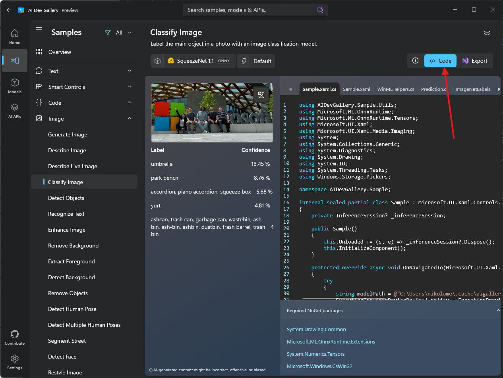

# Creating a WinML Addon

This guide shows you how to create a C# native addon that uses Windows Machine Learning (WinML) in your Electron app. WinML allows you to run machine learning models (ONNX format) locally on Windows devices for tasks like image classification, object detection, and more.

## Prerequisites

Before starting this guide, make sure you've:
- Completed the [development environment setup](setup.md)
- **Windows 11** or Windows 10 (version 1809 or later)

> [!NOTE]
> WinML runs on any Windows 10 (1809+) or Windows 11 device. For best performance, devices with GPUs or NPUs are recommended, but the API works on CPU as well.

## Step 1: Create a C# Native Addon

Let's create a native addon that will use WinML APIs. We'll use a C# template that leverages [node-api-dotnet](https://github.com/microsoft/node-api-dotnet) to bridge JavaScript and C#.

```bash
npx winapp node create-addon --template cs --name winMlAddon
```

This creates a `winMlAddon/` folder with:
- `addon.cs` - Your C# code that will call WinML APIs
- `winMlAddon.csproj` - Project file with references to Windows SDK and Windows App SDK
- `README.md` - Documentation on how to use the addon

The command also adds a `build-winMlAddon` script to your `package.json` for building the addon:
```json
{
  "scripts": {
    "build-winMlAddon": "dotnet publish ./winMlAddon/winMlAddon.csproj -c Release"
  }
}
```

The template automatically includes references to both SDKs, so you can immediately start calling Windows APIs!

Let's verify everything is set up correctly by building the addon:

```bash
# Build the C# addon
npm run build-winMlAddon
```

> **Note:** You can also create a C++ addon using `npx winapp node create-addon` (without the `--template` flag). C++ addons use [node-addon-api](https://github.com/nodejs/node-addon-api) and provide direct access to Windows APIs with maximum performance. See the [full command documentation](../../usage.md#node-create-addon) for more options.

## Step 2: Download the SqueezeNet Model and Get Sample Code

We'll use the **Classify Image** sample from the [AI Dev Gallery](https://aka.ms/aidevgallery) as our reference. This sample uses the SqueezeNet 1.1 model for image classification.

### 2.1. Download the Model

1. Install the [AI Dev Gallery](https://aka.ms/aidevgallery)
2. Navigate to the **Classify Image** sample
3. Download the **SqueezeNet 1.1** model (it supports CPU, GPU, and NPU)
4. Click **Open Containing Folder** to locate the `.onnx` file


5. Copy the `squeezenet1.1.onnx` file to a `models/` folder in your project root

## Step 3: Add Required NuGet Packages

Before adding the WinML code, we need to add two additional NuGet packages that are required for image processing and ONNX Runtime extensions.

### 3.1. Update Directory.packages.props

Add the following package versions to the `Directory.packages.props` file in the root of your project (should have been created when you created the addon):

```diff
<Project>
  <PropertyGroup>
    <!-- Enable central package versioning -->
    <ManagePackageVersionsCentrally>true</ManagePackageVersionsCentrally>
  </PropertyGroup>
  <ItemGroup>
    <PackageVersion Include="Microsoft.JavaScript.NodeApi" Version="0.9.17" />
    <PackageVersion Include="Microsoft.JavaScript.NodeApi.Generator" Version="0.9.17" />
    <!-- Add these two packages for WinML -->
+   <PackageVersion Include="Microsoft.ML.OnnxRuntime.Extensions" Version="0.14.0" />
+   <PackageVersion Include="System.Drawing.Common" Version="9.0.9" />
    
    <!-- These versions may be updated automatically during restore to match yaml -->
    <PackageVersion Include="Microsoft.WindowsAppSDK" Version="2.0.0-experimental3" />
    <PackageVersion Include="Microsoft.Windows.SDK.BuildTools" Version="10.0.26100.7175" />
  </ItemGroup>
</Project>
```

### 3.2. Update winMlAddon.csproj

Open `winMlAddon/winMlAddon.csproj` and add the package references to the `<ItemGroup>`:

```diff
<ItemGroup>
  <PackageReference Include="Microsoft.JavaScript.NodeApi" />
  <PackageReference Include="Microsoft.JavaScript.NodeApi.Generator" />
  <!-- Add these two packages for WinML -->
+ <PackageReference Include="Microsoft.ML.OnnxRuntime.Extensions" />
+ <PackageReference Include="System.Drawing.Common" />
  
  <PackageReference Include="Microsoft.Windows.SDK.BuildTools" />
  <PackageReference Include="Microsoft.WindowsAppSDK" />
</ItemGroup>
```

**What these packages do:**
- **Microsoft.ML.OnnxRuntime.Extensions** - Provides additional operators and utilities for ONNX Runtime
- **System.Drawing.Common** - Enables image loading and manipulation for preprocessing

## Step 4: Add the Sample Code

The AI Dev Gallery shows the complete implementation for image classification with SqueezeNet:



We've adapted this code for Electron and you can find the complete implementation in the [electron-winml sample](../../../samples/electron-winml/). The `winMlAddon/` folder contains the modified code from the AI Dev Gallery.

You can either:

**Option A: Copy from the sample**
Copy the entire `winMlAddon/` folder from [samples/electron-winml/winMlAddon/](../../../samples/electron-winml/winMlAddon/) to your project root, replacing the one created in Step 1.

**Option B: Manually update your addon**
Open `winMlAddon/addon.cs` and update it with the code from the sample. The complete source is available at [samples/electron-winml/winMlAddon/addon.cs](../../../samples/electron-winml/winMlAddon/addon.cs).

### Key Implementation Details

Let's highlight the important parts of the implementation and key differences from the AI Dev Gallery code:

#### 1. Project Root Path Requirement

Unlike the AI Dev Gallery code, our Electron addon requires the JavaScript code to pass the **project root path**. This is necessary because:
- The addon needs to locate the ONNX model file in the `models/` folder
- Native dependencies (DLLs) need to be loaded from specific directories

```csharp
[JSExport]
public static async Task<Addon> CreateAsync(string projectRoot)
{
    if (!Path.Exists(projectRoot))
    {
        throw new Exception("Project root is invalid.");
    }

    var addon = new Addon(projectRoot);
    addon.PreloadNativeDependencies();

    string modelPath = Path.Join(projectRoot, "models", @"squeezenet1.1-7.onnx");
    await addon.InitModel(modelPath, ExecutionProviderDevicePolicy.DEFAULT, null, false, null);

    return addon;
}
```

This automatically selects the best execution provider (CPU, GPU, or NPU) based on device capabilities.

#### 2. Preloading Native Dependencies

The addon includes a `PreloadNativeDependencies()` method to load required DLLs. This approach works for both **development and production** scenarios without needing to copy DLLs to the project root:

```csharp
private void PreloadNativeDependencies()
{
    // Loads required DLLs from the winMlAddon build output
    // This ensures dependencies are available regardless of the execution context
}
```

This is called during initialization before loading the model, ensuring all native libraries are available.

#### 3. Configuring Electron Forge for Packaging

To ensure the addon works correctly in production builds, you need to configure your packager to:
1. **Unpack native files** - DLLs, ONNX models, and .node files must be accessible outside the ASAR archive
2. **Exclude unnecessary files** - Keep the package size small by excluding build artifacts and temporary files

For **Electron Forge**, update your `forge.config.js`:

```javascript
// From samples/electron-winml/forge.config.js
module.exports = {
  packagerConfig: {
    asar: {
      // Unpack native files so they can be accessed by the addon
      unpack: "**/*.{dll,exe,node,onnx}"
    },
    ignore: [
      // Exclude .winapp folder (SDK packages and headers)
      /^\/.winapp\//,
      // Exclude MSIX packages
      "\\.msix$",
      // Exclude winMlAddon source files, but keep the dist folder
      /^\/winMlAddon\/(?!dist).+/
    ]
  },
  // ... rest of your config
};
```

**What this does:**

1. **`asar.unpack`** - Extracts DLLs, executables, .node binaries, and ONNX models to `app.asar.unpacked/`
   - This makes them accessible at runtime via file system paths
   - The JavaScript code adjusts paths automatically (see the `app.asar` → `app.asar.unpacked` replacement above)

2. **`ignore`** - Excludes from the final package:
   - `.winapp/` - SDK packages and headers (not needed at runtime)
   - `.msix` files - Packaged outputs
   - `winMlAddon/` source files - Keeps only the `dist/` folder with compiled binaries

> **📝 Note:** If you're using a different packaging tool (electron-builder, etc.), you'll need to configure similar settings for unpacking native dependencies and excluding development files. Check your packager's documentation for ASAR unpacking options.

#### 4. Image Classification

The `ClassifyImage` method processes an image and returns predictions:

```csharp
[JSExport]
public async Task<Prediction[]> ClassifyImage(string imagePath)
{
    // Loads the image, preprocesses it, and runs inference
    // Returns top predictions with labels and confidence scores
}
```

The complete implementation handles:
- Image loading and preprocessing (resizing, normalization)
- Running the model inference
- Post-processing results to get top predictions with labels and confidence scores

> **📝 Note:** The full source code includes image preprocessing, tensor creation, and result parsing. Check the [sample implementation](../../../samples/electron-winml/winMlAddon/addon.cs) for all the details.

### Understanding the Code

The addon provides these main functions:

1. **CreateAsync** - Initializes the addon and loads the SqueezeNet model
2. **ClassifyImage** - Takes an image path and returns classification predictions

WinML automatically selects the best execution device (CPU, GPU, or NPU) based on availability.

## Step 5: Build the C# Addon

Now build the addon:

```bash
npm run build-winMlAddon
```

This compiles your C# code using **Native AOT** (Ahead-of-Time compilation), which:
- Creates a `.node` binary (native addon format)
- Trims unused code for smaller bundle size
- Requires **no .NET runtime** on target machines
- Provides native performance

The compiled addon will be in `winMlAddon/dist/winMlAddon.node`.

## Step 6: Test the Addon

Now let's test the addon works by calling it from the main process. Open `src/index.js` and follow these steps:

### 6.1. Load the Addon

Add the require statements at the top:

```javascript
const winMlAddon = require('../winMlAddon/dist/winMlAddon.node');
```

### 6.2. Create a Test Function

Add this function to test image classification:

```javascript
const testWinML = async () => {
  console.log('Testing WinML addon...');
  
  try {
    let projectRoot = path.join(__dirname, '..');
    // Adjust path for packaged apps
    if (projectRoot.includes('app.asar')) {
      projectRoot = projectRoot.replace('app.asar', 'app.asar.unpacked');
    }
    
    const addon = await winMlAddon.Addon.createAsync(projectRoot);
    console.log('Model loaded successfully!');
    
    // Classify a sample image
    const imagePath = path.join(projectRoot, 'test-images', 'sample.jpg');
    const predictions = await addon.classifyImage(imagePath);
    
    console.log('Top predictions:');
    predictions.slice(0, 5).forEach((pred, i) => {
      console.log(`${i + 1}. ${pred.label}: ${(pred.confidence * 100).toFixed(2)}%`);
    });
  } catch (error) {
    console.error('Error testing WinML:', error.message);
  }
};
```

**Key points:**
- The path adjustment (`app.asar` → `app.asar.unpacked`) ensures the code works in both development and packaged apps
- This accesses the unpacked native files configured in `forge.config.js`

### 6.3. Call the Test Function

Add this line at the end of the `createWindow()` function:

```javascript
testWinML();
```

### 6.4. Prepare Test Images

To test image classification:

1. Create a `test-images/` folder in your project root
2. Add some test images (e.g., `sample.jpg`, `cat.jpg`, `dog.jpg`)
3. The SqueezeNet model recognizes 1000 different ImageNet classes

When you run the app, you'll see the classification results in the console!

> **💡 Tip:** For a complete implementation with IPC handlers, file selection dialogs, and a UI, see the [electron-winml sample](../../../samples/electron-winml/src/index.js).

## Step 7: Update Debug Identity

To ensure the Windows App SDK is loaded and available for usage, we need to ensure we setup debug identity which will ensure the framework is loaded whenever our app runs. Likewise, whenever you modify `appxmanifest.xml` or change assets referenced in the manifest (like app icons), you need to update your app's debug identity. Run:

```bash
npx winapp node add-electron-debug-identity
```

This command:
1. Reads your `appxmanifest.xml` to get app details and capabilities
2. Registers `electron.exe` in your `node_modules` with a temporary identity
3. Enables you to test identity-required APIs without full MSIX packaging

> **📝 Note:** This command is already part of the `postinstall` script we added in the setup guide, so it runs automatically after `npm install`. However, you need to run it manually whenever you:
> - Modify `appxmanifest.xml` (change capabilities, identity, or properties)
> - Update app assets (icons, logos, etc.)

Now run your app:

```bash
npm start
```

Check the console output - you should see the WinML test results!

<details>
<summary><b>⚠️ Known Issue: App Crashes or Blank Window (click to expand)</b></summary>

There is a known Windows bug with sparse packaging Electron applications which causes the app to crash on start or not render web content. The issue has been fixed in Windows but has not yet propagated to all devices.

See [development environment setup](setup.md) for workaround.

</details>

## Next Steps

Congratulations! You've successfully created a native addon that can run machine learning models with WinML! 🎉

Now you're ready to:
- **[Package Your App for Distribution](packaging.md)** - Create an MSIX package that you can distribute

Or explore other guides:
- **[Creating a Phi Silica Addon](phi-silica-addon.md)** - Learn how to use the Phi Silica AI API
- **[Getting Started Overview](../../electron-get-started.md)** - Return to the main guide

### Customizing for Your Model

To fully integrate your ONNX model, you'll need to:

1. **Understand your model's inputs** - Images, tensors, sequences, etc.
2. **Create proper input bindings** - Convert your data to the format WinML expects
3. **Process the outputs** - Parse and interpret the model's predictions
4. **Handle errors gracefully** - Model loading and inference can fail

### Additional Resources

- **[WinML Documentation](https://learn.microsoft.com/windows/ai/new-windows-ml/overview)** - Official WinML documentation
- **[WinAppCLI Documentation](../../usage.md)** - Full CLI reference
- **[Sample Electron App](../../../samples/electron/)** - Complete working example
- **[AI Dev Gallery](https://aka.ms/aidevgallery)** - Sample gallery of all AI APIs 
- **[Windows App SDK Samples](https://github.com/microsoft/WindowsAppSDK-Samples/tree/main/Samples/WindowsML)** - Collection of Windows App SDK samples
- **[node-api-dotnet](https://github.com/microsoft/node-api-dotnet)** - C# ↔ JavaScript interop library

### Get Help

- **Found a bug?** [File an issue](https://github.com/microsoft/WinAppCli/issues)
- **WinML questions?** Check the [WinML documentation](https://learn.microsoft.com/windows/ai/windows-ml/)

Happy machine learning! 🤖
